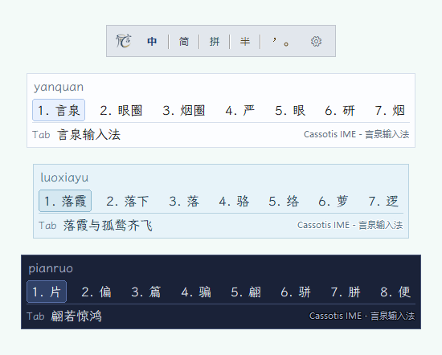

# Cassotis IME（言泉輸入法）

<p align="center">
  
</p>

<p align="center">
  <a href="LICENSE"></a>
</p>
<p align="center">
  
</p>

[English](README.md) | [簡體中文](README.zh-Hans.md) | 繁體中文

Cassotis IME（言泉輸入法）是一款適用於 Windows 10/11 的實驗性中文拼音輸入法，主要以 Delphi 開發，並建構於 TSF（Text Services Framework）之上。

## 名稱來源
英文名 **Cassotis** 源自 Delphi 神廟內的一眼聖泉。傳說女祭司皮媞亞（Pythia）在發布神諭前會飲用此泉水，以進入通靈狀態。這眼泉水被視為預言與靈感的真正源頭，也是神諭誕生之地，呼應了從 Delphi 到人類語言的路徑。

中文名 **言泉** 既契合 Cassotis 作為預言之泉的意象，也取「言如泉湧」的寓意，寄託了對流暢、智慧輸入體驗的期許。

專案目前重點：
- 建立穩定的 TSF 輸入法基礎；
- 保持模組化架構（TSF DLL + host 處理程序 + 工具鏈）；
- 持續改進語料訓練驅動的長句排序與短詞前後文排序。

## 目前狀態
- TSF 文字服務主流程已可用（註冊、啟用、組合生命週期）。
- TSF DLL 同時支援 Win64 與 Win32（`svr.dll` / `svr32.dll`），host 處理程序僅保留 Win64。
- 已實作候選視窗、換頁、選詞與送出文字流程。
- 支援全拼及六種可選雙拼方案：微軟雙拼、小鶴雙拼、自然碼雙拼、搜狗雙拼、紫光雙拼和拼音加加；所有方案共用候選排序與使用者學習資料。
- 支援可分別設定的常見聲母、韻母模糊規則。
- 支援詞庫分離：簡體基礎庫、繁體基礎庫、使用者詞庫。
- 已整合語料訓練驅動的多階段長句排序，在不影響短詞精確比對模式的前提下，依序參與路徑搜尋、第二階段比較和最終候選選擇。
- 已整合獨立的短詞前後文重排器，依據游標前已送出的文字處理有歧義的精確候選；沒有可用前後文時維持原有排序。
- 已實作前後文同步（surrounding text）與按鍵狀態同步。

## 架構
- `src/tsf`：TSF COM 處理程序內服務（文字服務介接層）。
- `src/engine`：拼音解析、候選產生、排序與使用者學習。
- `src/host`：外部 host 處理程序，負責引擎/UI 協同。
- `src/ui`：候選視窗與系統匣 UI。
- `src/common`：設定、記錄檔、IPC、SQLite 封裝與共用工具。
- `tools`：註冊、詞庫建置/匯入/診斷等工具程式。

## 儲存庫結構
- `src/` 原始碼
- `tools/` 工具工程與輔助可執行程式
- `data/` schema 與詞表原始資料
- `out/` 建置/註冊/重建/測試指令碼
- `third_party/` 第三方二進位檔/原始碼（例如 SQLite 執行階段套件）

## 關鍵二進位檔
- `cassotis_ime_svr.dll`（Win64 TSF 處理程序內 COM 服務）
- `cassotis_ime_svr32.dll`（Win32 TSF 處理程序內 COM 服務）
- `cassotis_ime_host.exe`（Win64 host 處理程序）
- `cassotis_ime_tray_host.exe`（Win64 系統匣/狀態宿主，負責系統匣選單、浮動狀態視窗和輸入狀態顯示）
- `cassotis_ime_profile_reg.exe`（TSF profile/category 註冊工具）

若缺少 TSF DLL 或主要 host 處理程序，輸入法將無法正常運作。若缺少系統匣/狀態宿主，核心輸入流程可能仍可執行，但系統匣選單、浮動狀態視窗和狀態顯示將無法使用。

## 建置與執行（快速開始）
前置需求：
- Windows 10/11
- Delphi 10.4
- SQLite 執行階段程式庫（`sqlite3_64.dll`）

在 `out/` 目錄執行：

```powershell
.\rebuild_all.ps1
.\cassotis_ime_profile_reg.exe register_tsf -dll_path .\cassotis_ime_svr.dll
.\rebuild_dict.ps1
```

完整建置說明見 `BUILD.md`。

## 詞庫流程
目前的基礎詞庫流程會從 [cassotis-lexicon](https://github.com/shenmin/cassotis-lexicon) 專案匯入產生的詞庫檔案：
- 匯入輸入檔案：`dict_unihan_sc.txt`、`dict_unihan_tc.txt`、`dict_clean_sc.txt`、`dict_clean_tc.txt`
- 執行階段資料庫會重建至 `%LOCALAPPDATA%\CassotisIme\data\`（如 `dict_sc.db`、`dict_tc.db`）
- 使用者詞庫預設位於 `%LOCALAPPDATA%\CassotisIme\data\user_dict.db`

詞庫重建入口：

```powershell
.\rebuild_dict.ps1
```

## 語料訓練增強的本機排序
Cassotis v1.1.0 引入離線訓練的本機統計語言模型，用於改進長句路徑排序。訓練流程會從清理後的通用中文語料與小說語料中，學習受詞庫約束的詞級二元、三元轉移關係，以及具平滑退避機制的字元級三元語言模型。「長句基準測試-16300」語料與訓練資料彼此隔離，不參與模型訓練。

Cassotis v1.3.0 新增專案首個可部署的長句神經殘差重排器。這個精簡的前饋神經模型，以受詞庫約束的 N-best 候選比較資料進行離線訓練，保守地提升更合理的完整長句候選，同時保留原始引擎結果作為後備。

Cassotis v1.4.0 將同樣的離線訓練方法擴充至短詞輸入。獨立的前後文重排器會結合字元 LM 訊號與游標前已送出的文字，比較同一拼音下的精確候選。它只會在左側有前後文且有多個精確候選競爭時參與排序；沒有可用前後文時，短詞候選仍維持原有順序。

Cassotis v1.5.0 將短詞前後文排序擴充為兩階段本機神經重排。第一階段從相互競爭的精確候選中選出更符合前文的結果，第二階段再由獨立訓練的殘差模型進行保守修正，只在分數優勢超過門檻時改變排序。沒有前後文的短詞輸入仍不會進入這條模型路徑。

Cassotis v1.6.0 將長句解碼推進為語料訓練驅動的多階段流程：搜尋狀態模型會在路徑遭到剪枝前協助保留較有希望的結果，獨立的第二階段模型比較保留下來的完整路徑，最終候選模型再搭配學習而得的後備策略進行複核，只有證據足夠可靠時才改變原始排序。這些模型以受詞庫約束的候選比較資料進行離線訓練，不依賴針對基準句子的特例規則。

Cassotis v1.7.0 改進短輸入的詞組合能力。四音節輸入可在語料訓練得到的轉移證據足夠強時，組合兩個完整詞庫詞，同時繼續排除缺乏依據的組合；詞組前綴和首音節單字候選仍會顯示，選取部分候選後，剩餘的單字候選也會結合已選文字進行前後文排序。

Cassotis v1.8.0 同時加強長句與短詞的學習排序。長句在既有多階段流程上新增成對比較、局部差異和可見候選殘差複核，在不改變詞庫約束產生規則的前提下，更準確地區分完整候選。短詞則加入獨立訓練的無前後文殘差排序，並透過保守的可信度校準，在模型證據不足時保留可信度較高的精確比對。

Cassotis v1.9.0 將長句召回與排序升級為語料訓練驅動的統一完整候選池，在詞庫約束下保留結構多樣的完整路徑，再結合語言模型、N-best 共識和殘差訊號統一排序。可信度門控與時間預算用來維持結果穩定並降低延遲。

Cassotis v1.10.0 將語料訓練得到的轉移證據擴充至受控的 1+2 和 2+1 精確詞組合，用於改善三音節輸入，同時為長句前兩項加入保守的成對複核。兩條路徑都只會在學習證據足夠強時調整結果。

Cassotis v1.11.0 擴充語料訓練得到的詞級轉移覆蓋，在 LM 證據充分時改善短詞組合與長句路徑選擇。

Cassotis v1.12.0 將語料轉移證據擴充至詞庫未收錄、受嚴格約束的 1+1 單字組合。僅保留具有多來源支持且使用常見讀音的候選，詞庫精確比對仍然優先；同一訊號在長句中只用於區分分數接近的路徑。

Cassotis v1.13.0 新增雙向精確詞錨定的長句路徑復原及短詞前後文差異感知重排，結合正反向 LM、8 至 12 字前文與嚴格可信度門檻，只對真正存在競爭的候選作審慎調整。

Cassotis v1.14.0 將精確詞錨定復原擴充為受控的完整路徑候選池，並加強短詞前後文差異排序及 LM 支援的短語續接。來自不同復原管道的完整路徑會由統一的本機排序器，依據語料訓練證據審慎比較。

為了讓更深入的排序流程仍能迅速回應，搜尋、第二階段排序、殘差比較和最終選擇會共用字元 LM 分數、詞庫精確查詢、路徑特徵和前後文分數。計算量較大的共識比較與詞庫查詢會使用共用快取及明確的時間預算，以抑制長尾延遲。系統也會繼續保護精確比對與前綴候選的可見性，並避免不同排序階段重複執行相同計算。

統計模型經過量化後寫入本機詞庫資料庫，精簡的重排器則匯出為具確定性的原生 Pascal 參數。執行階段只會在本機進行規模受控的評分，不會啟動 PyTorch/ONNX 環境或外部模型服務，也不需要網路連線或 GPU。長句與短詞使用彼此獨立的排序路徑，其中一條路徑的改進不會取代另一條路徑的比對規則。

## 長句基準測試-16300
測試方法、語料來源和評分規則見 [BENCHMARK.CN.md](BENCHMARK.CN.md)。

語料：開發者自己的小說著作 [**《永恆的舞動》**](https://www.qidian.com/book/1037259117/) 中 16,300 條符合條件的中文句子。

| 版本 | Top1 | Top2 | Mean (ms) | P50 (ms) | P95 (ms) | Max (ms) |
|---|---:|---:|---:|---:|---:|---:|
| `v1.14.0` | 10345/16300 (63.47%) | 11903/16300 (73.02%) | 58.78 | 47 | 172 | 766 |
| `v1.13.0` | 10131/16300 (62.15%) | 11320/16300 (69.45%) | 65.94 | 47 | 203 | 1047 |
| `v1.12.0` | 9767/16300 (59.92%) | 10996/16300 (67.46%) | 63.03 | 47 | 187 | 1062 |
| `v1.11.0` | 9760/16300 (59.88%)<br>*9340/16300 (57.30%)* | 10990/16300 (67.42%)<br>*10773/16300 (66.09%)* | 59.82 | 47 | 187 | 1031 |
| `v1.10.0` | 9279/16300 (56.93%) | 10708/16300 (65.69%) | 60.39 | 47 | 188 | 1046 |
| `v1.9.0` | 9121/16300 (55.96%) | 10685/16300 (65.55%) | 59.65 | 47 | 187 | 1172 |
| `v1.8.1` | 8285/16300 (50.83%) | 9067/16300 (55.63%) | 72.44 | 47 | 281 | 1594 |
| `v1.7.0` | 7940/16300 (48.71%) | 8642/16300 (53.02%) | 71.55 | 47 | 235 | 2047 |
| `v1.6.0` | 7936/16300 (48.69%) | 8637/16300 (52.99%) | 66.99 | 32 | 219 | 1687 |
| `v1.5.0` | 7459/16300 (45.76%) | 7966/16300 (48.87%) | 63.42 | 46 | 203 | 2140 |
| `v1.4.0` | 7168/16300 (43.98%) | 7617/16300 (46.73%) | 66.23 | 46 | 218 | 2578 |
| `v1.3.0` | 7155/16300 (43.90%) | 7601/16300 (46.63%) | 64.54 | 46 | 203 | 2188 |
| `v1.2.0` | 6895/16300 (42.30%) | 7303/16300 (44.80%) | 59.89 | 32 | 188 | 2078 |
| `v1.1.0` | 6677/16300 (40.96%) | 7067/16300 (43.36%) | 73.18 | 47 | 234 | 2750 |
| `v1.0.0` | 6106/16300 (37.46%) | 6857/16300 (42.07%) | 71.49 | 47 | 219 | 5344 |
| `v0.8.5` | 6097/16300 (37.40%) | 6847/16300 (42.01%) | 520.05 | 406 | 1203 | 13297 |
| `v0.7.0` | 5368/16300 (32.93%) | 6110/16300 (37.48%) | — | — | — | — |
| `v0.6.0` | 4905/16300 (30.09%) | 5378/16300 (32.99%) | — | — | — | — |
| `v0.5.0` | 4834/16300 (29.66%) | 5243/16300 (32.17%) | — | — | — | — |
| `v0.4.0` | 4371/16300 (26.82%) | 4744/16300 (29.10%) | — | — | — | — |
| `v0.3.1` | 3845/16300 (23.59%) | 4651/16300 (28.53%) | — | — | — | — |
| `v0.2.0` | 2671/16300 (16.39%) | 2863/16300 (17.56%) | — | — | — | — |

`v1.12.0` 採用「相同位置的『他／她』視為等價」的新評分標準。`v1.11.0` 的一般數值採用此標準，斜體數值則是嚴格區分「他／她」的舊標準結果；`v1.10.0` 及更早版本均採用舊標準。從 `v1.12.0` 起只公布新標準結果。

延遲資料是引擎一次設定整句拼音後的解碼耗時，不代表逐鍵輸入至候選視窗顯示的端對端延遲。`—` 表示該版本未依此方式測量延遲。完整方法請參閱 [BENCHMARK.CN.md](BENCHMARK.CN.md)。

## 短詞前後文基準測試-65000
這項基準包含 65,000 個二至四字詞的實際出現位置，每筆案例都保留該詞之前已送出的句子前文。案例與「長句基準測試-16300」取自同一篇小說文本，並已從短詞前後文模型的訓練資料中排除。評估時會關閉使用者詞庫排序。

共同語料來源、短詞案例建置方式、評分規則和延遲測量方式請參閱 [BENCHMARK.CN.md](BENCHMARK.CN.md)。

`Contested` 表示同一拼音在語料中對應至少兩個目標詞的歧義子集，最能反映前後文排序的作用。下表採用啟用前後文的基準測試結果。

| 版本 | Top1 | Top2 | Contested Top1 | Contested Top2 | Mean (ms) | P50 (ms) | P95 (ms) | Max (ms) |
|---|---:|---:|---:|---:|---:|---:|---:|---:|
| `v1.14.0` | 61782/65000 (95.05%) | 63516/65000 (97.72%) | 9560/11728 (81.51%) | 10775/11728 (91.87%) | 3.998 | 3.132 | 8.665 | 68.147 |
| `v1.13.0` | 61515/65000 (94.64%) | 63516/65000 (97.72%) | 9384/11728 (80.01%) | 10775/11728 (91.87%) | 4.748 | 3.652 | 10.337 | 103.689 |
| `v1.12.0` | 61343/65000 (94.37%) | 63474/65000 (97.65%) | 9304/11728 (79.33%) | 10745/11728 (91.62%) | 4.400 | 3.417 | 9.462 | 104.316 |
| `v1.11.0` | 61343/65000 (94.37%)<br>*61227/65000 (94.20%)* | 63474/65000 (97.65%)<br>*63461/65000 (97.63%)* | 9304/11728 (79.33%)<br>*9191/11728 (78.37%)* | 10745/11728 (91.62%)<br>*10732/11728 (91.51%)* | 4.217 | 3.284 | 9.110 | 75.503 |
| `v1.10.0` | 61214/65000 (94.18%) | 63448/65000 (97.61%) | 9191/11728 (78.37%) | 10732/11728 (91.51%) | 4.425 | 3.446 | 9.591 | 84.68 |
| `v1.9.0` | 61215/65000 (94.18%) | 63448/65000 (97.61%) | 9191/11728 (78.37%) | 10732/11728 (91.51%) | 4.214 | 3.268 | 9.113 | 71.004 |
| `v1.8.1` | 61206/65000 (94.16%) | 63430/65000 (97.58%) | 9182/11728 (78.29%) | 10725/11728 (91.45%) | 4.85 | 3.721 | 10.413 | 107.714 |
| `v1.7.0` | 61053/65000 (93.93%) | 63424/65000 (97.58%) | 9154/11728 (78.05%) | 10723/11728 (91.43%) | 4.668 | 3.468 | 10.013 | 158.471 |
| `v1.6.0` | 61043/65000 (93.91%) | 63414/65000 (97.56%) | 9154/11728 (78.05%) | 10723/11728 (91.43%) | 4.455 | 3.295 | 9.580 | 160.817 |
| `v1.5.0` | 61045/65000 (93.92%) | 63364/65000 (97.48%) | 9159/11728 (78.10%) | 10677/11728 (91.04%) | 5.033 | 4.113 | 9.968 | 142.372 |
| `v1.4.0` | 60676/65000 (93.35%) | 63251/65000 (97.31%) | 8993/11728 (76.68%) | 10602/11728 (90.40%) | 5.573 | 4.521 | 11.157 | 158.687 |
| `v1.3.0` | 59078/65000 (90.89%) | 62881/65000 (96.74%) | 8326/11728 (70.99%) | 10386/11728 (88.56%) | 5.460 | 4.396 | 10.939 | 176.912 |

`v1.12.0` 採用「相同位置的『他／她』視為等價」的新評分標準。`v1.11.0` 的一般數值採用此標準，斜體數值則是嚴格區分「他／她」的舊標準結果；`v1.10.0` 及更早版本均採用舊標準。從 `v1.12.0` 起只公布新標準結果。

延遲資料為啟用前後文之測試模式下的引擎單次查詢耗時，不包含 TSF 呼叫和候選視窗繪製時間。

## 設定
預設設定檔：
- `%LOCALAPPDATA%\CassotisIme\cassotis_ime.ini`

主要設定項目包括：
- 拼音方案（全拼 / 微軟雙拼 / 小鶴雙拼 / 自然碼雙拼 / 搜狗雙拼 / 紫光雙拼 / 拼音加加）
- 簡/繁體切換（`variant`）
- 全形 / 標點模式
- 除錯記錄與記錄檔路徑

執行階段詞庫路徑固定在 `%LOCALAPPDATA%\CassotisIme\data\`，不再透過 INI 設定。

## 文件
- 英文主文件：`README.md`
- 簡體中文文件：[README.zh-Hans.md](README.zh-Hans.md)
- 設定說明：`CONFIGURE.md`
- 建置說明：`BUILD.md`
- 第三方元件說明：`THIRD_PARTY.md`

## 授權
本專案採用 GPL-3.0 授權，完整條文請參閱 `LICENSE`。

請確保第三方聲明與權利歸屬資訊和 `THIRD_PARTY.md` 保持一致。

## 路線圖
- 以獨立語料和 N-best 比較樣本繼續訓練精簡的本機重排器
- 擴充獨立基準與失敗原因分析，用於校準模型門檻和後備策略
- 強化使用者詞庫品質控制與工具鏈
- 擴充編輯器/瀏覽器/IDE 相容性矩陣
